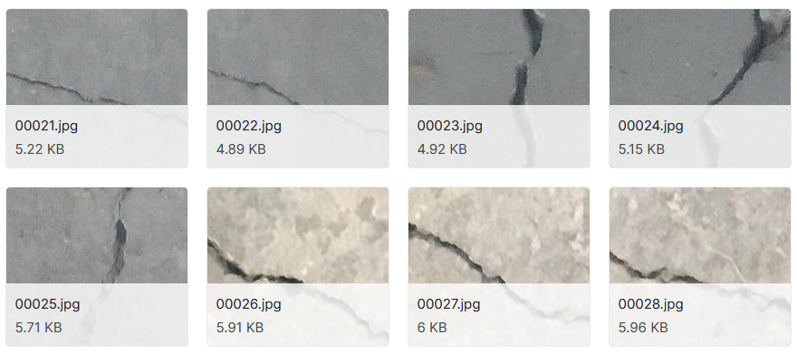
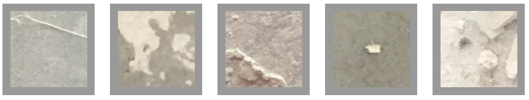
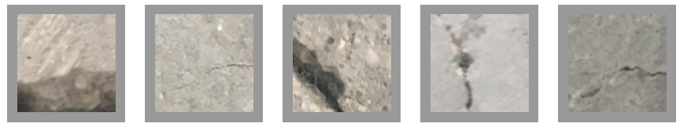

# Surface Crack Classification

### Dataset

* [Concrete Crack Images for Classification](https://data.mendeley.com/datasets/5y9wdsg2zt/2)
* [Surface Crack Detection Dataset | Kaggle](https://www.kaggle.com/arunrk7/surface-crack-detection)

The datasets contains images of various concrete surfaces with and without crack. The image data are divided into two as negative (without crack) and positive (with crack) in separate folder for image classification. Each class has 20000 images with a total of 40000 images with 227 x 227 pixels with RGB channels. The dataset is generated from 458 high-resolution images (4032x3024 pixel) with the method proposed by Zhang et al (2016). High resolution images found out to have high variance in terms of surface finish and illumination condition. No data augmentation in terms of random rotation or flipping or tilting is applied.

##### Positive samples

##### Negative samples

### Approach

This code uses pretrained AlexNet model ([torchvision.models](https://pytorch.org/docs/stable/torchvision/models.html)) with trainable classifier part (see layers below).  
Dataset has been split into train, validation and test subsets. Training parameters and configuration can be found in `config.yaml` file.

Classifier weights summary produced by Pytorch Lightning:

> 18 | model.classifier   | Sequential        | 54 M  
> 19 | model.classifier.0 | Dropout           | 0  
> 20 | model.classifier.1 | Linear            | 37 M  
> 21 | model.classifier.2 | ReLU              | 0  
> 22 | model.classifier.3 | Dropout           | 0  
> 23 | model.classifier.4 | Linear            | 16 M  
> 24 | model.classifier.5 | ReLU              | 0  
> 25 | model.classifier.6 | Linear            | 4 K  

### Results

Full training histories are available on [Neptune.ai](https://ui.neptune.ai/mtszkw/surface-crack-detect/experiments?viewId=standard-view). There are metrics from last 5 experiments (test set i.e. 10% of dataset):

|Experiment   	|Loss   	|F1   	|Precision   	|Recall   	|
|---	|---	|---	|---	|---	|
|SUR-123   	|0.0111392   	|0.99682   	|0.996124   	|0.997614   	|
|SUR-122   	|0.0391901   	|0.996263   	|0.9977   	|0.994944   	|
|SUR-121   	|0.0084417   	|0.997644   	|0.996335   	|0.999034   	|
|SUR-120   	|0.00985253   	|0.997192   	|0.995856   	|0.998618   	|
|SUR-119   	|0.00772782   	|0.998859   	|0.998836   	|0.998923   	|

##### False Positives

##### False Negative

